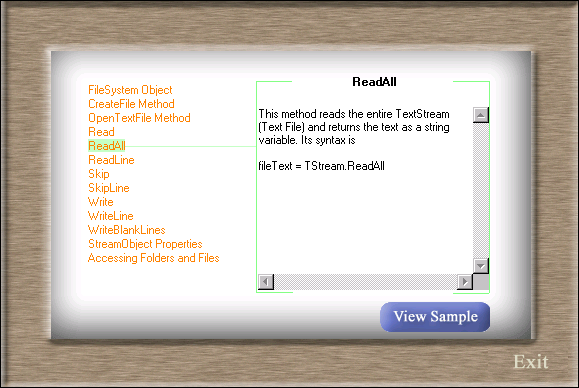



## Learn about FileSystem OBject

### Description

This example will explain about How to use the FileSystem Object to do your file operations.

This Object is available in vbScript and in vb also. File and Folder operations can be done

with this object very easily.

This program itself used this object to obtain data from file. Few working examples were added

with this program to understand better.

You will come to know something about FileSystem Object or get some code snippets or ideas from this code.

This example explains about the file operations. Soon I will update the Folder Operations. If anybody

is intrested in doing that I welcome them. It can be simply done by changing the source text file.

The same logic can be used to display similar kind of things.

Note:

The functions CharFound and SeperateString were extensively used by me in almost all of my programs. I suggest

you to use them freely in your code.

Please read the ReadMe.txt
 
### More Info
 

Select a topic from the lefthand side list. You can see the description for that topic. If help is

available for the topic View Sample button will be visible. Click the button. You can see some working example of the code.

             |
---                |---
**Submitted On**   |2002-03-15 11:45:44
**By**             |[kannan](https://github.com/Planet-Source-Code/PSCIndex/blob/master/ByAuthor/kannan.md)
**Level**          |Intermediate
**User Rating**    |4.9 (44 globes from 9 users)
**Compatibility**  |VB 6\.0
**Category**       |[Files/ File Controls/ Input/ Output](https://github.com/Planet-Source-Code/PSCIndex/blob/master/ByCategory/files-file-controls-input-output__1-3.md)
**World**          |[Visual Basic](https://github.com/Planet-Source-Code/PSCIndex/blob/master/ByWorld/visual-basic.md)
**Archive File**   |[Learn\_abou623163152002\.zip](https://github.com/Planet-Source-Code/kannan-learn-about-filesystem-object__1-32701/archive/master.zip)

